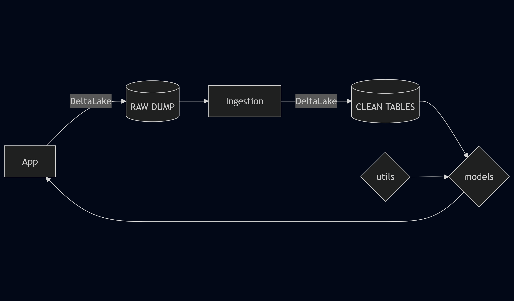

# Interest Rates backend API and analytics

With public rates or macro data, 
the objective is to model various target objectives,
using models of all sorts.

It is also a playground to get the gist around dev concepts and tools :
- REST API best practices
- Containerisation 
- Managing dependencies with uv
- Github workflow for CI



## Data
Because the idea is to gather data from different sources,
with, say, different ticking frequencies, qualities and types, 
the long run objective is to have a clean ingestion pipeline
that can gather each endpoint, 
manage exceptions without failing,
and run in a separate service.

Options :
- `pandas` / `polars` dataframe for a few datasources only (short term),
- https://datafusion.apache.org/
- https://iceberg.apache.org/
- https://github.com/delta-io/delta-rs?tab=readme-ov-file

Preprocessing and cleaning, then addition to or creation of new table.
Rust or Python ?

## Targets

**FR yields**
As a multivariate time-series prediction.

**Covariance matrix estimation**
For clustering (in terms of rates, or in terms of days to define market modes).

## Models

## Project structure

```bash
└── src             # containing both services and libraries
    ├── app         # API entrypoint 
    │   └── routers
    ├── ingestion   # pre-processing service, tables creation and serving
    │   └── src
    ├── models      # model application, training
    └── utils       # custom functions and model helpers
        └── test
```

**Tools overview :**

| Task | Package |
| --- | --- |
| Data preprocessing | polars |
| Linear algebra | numpy |
| Unit tests | pytest |
| API Routing | uvicorn, fastapi |


## Run API

To start the app, run :
```bash
uvicorn src.irbackend.main:app --reload
```

To build the image, run :
```bash
source run.sh
```

## References :
- to display full logging in the uvicorn app :
    https://gist.github.com/liviaerxin/d320e33cbcddcc5df76dd92948e5be3b
- https://github.com/actions/starter-workflows
- https://github.com/astral-sh/uv-docker-example
- https://docs.github.com/en/actions/writing-workflows/about-workflows
- https://github.com/ProsusAI/finBERT?tab=readme-ov-file
***

Data sources :
- https://www.kaggle.com/datasets/everget/government-bonds/data
- https://api.energy-charts.info/
- https://www.researchgate.net/publication/251231364_FinancialPhraseBank-v10/references
